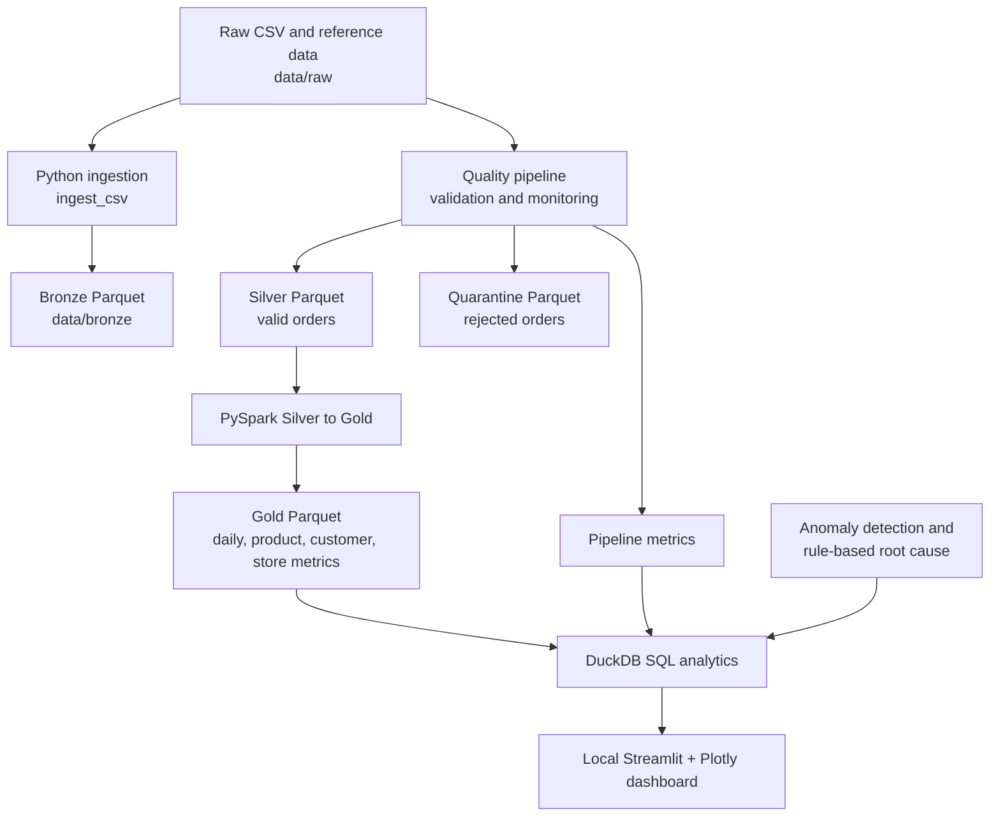

# DataForge Architecture

## Current Local Implementation

All stages currently run locally from the repository root:

- Sample CSV and reference data live under `data/raw/`.
- Python ingestion adds metadata and writes Bronze Parquet files.
- The quality pipeline applies schema, type, date, positivity, uniqueness, null, and referential-integrity checks.
- Valid orders go to Silver; rejected rows and failed-rule details go to Quarantine.
- The existing PySpark job transforms Silver orders into Gold aggregate datasets.
- Pipeline metrics are stored as Parquet and queried with DuckDB alongside the Gold datasets.
- Step 13 anomaly and root-cause functions provide deterministic rule-based intelligence.
- The Streamlit dashboard reads the local Gold Parquet outputs through DuckDB.

Generated Bronze, Silver, Gold, and Quarantine artifacts are intentionally ignored by Git. The raw sample CSVs remain tracked so the local pipeline is reproducible.

## Future Azure and Databricks Mapping

The current local stages provide a small-scale analogue for a cloud deployment, but DataForge is not currently deployed to Azure or Databricks. A future design could map:

- Azure Blob Storage or ADLS Gen2 to raw, Bronze, Silver, Gold, and Quarantine storage.
- Azure Data Factory or event-based ingestion to the Python ingestion boundary.
- Databricks jobs and Delta Lake to the validation and Spark transformation stages.
- Azure Monitor or a metrics store to pipeline health and alerting.
- Databricks SQL or serverless query services to the DuckDB analytics boundary.
- Azure App Service or a secured internal hosting platform to the dashboard.

Those services would require production security, orchestration, cataloging, observability, and deployment decisions that are outside this local portfolio implementation.
